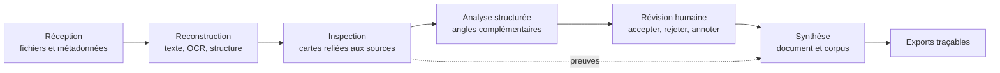

# OuiDire

**Analyse traçable et supervisée par l'humain pour les dossiers documentaires complexes.**

OuiDire, un produit de [Studiorium Inc.](https://studiorium.ai/), aide à transformer des dossiers longs et hétérogènes en un corpus navigable de preuves. Le système combine extraction documentaire, cartes structurées, plusieurs angles d'analyse, annotation humaine et synthèse reliée aux sources.

Ce dépôt est une vitrine technique publique. Il décrit les limites et principes du système sans publier le code de production, les prompts privés, les données de clients ni les règles de pondération propriétaires.

[English](README.md) · [Architecture](docs/architecture.md) · [Méthode](docs/method.md) · [Sécurité](SECURITY.md)

## Découvrir OuiDire

- **Site du produit :** [ouidire.app](https://ouidire.app/)
- **Entreprise et studio IA :** [studiorium.ai](https://studiorium.ai/)
- **Espace de travail français :** [beta-fr.ouidire.app](https://beta-fr.ouidire.app/)
- **English workspace:** [beta.ouidire.app](https://beta.ouidire.app/)

Les espaces de travail sont des environnements bêta actifs. Avant d'y déposer du contenu confidentiel ou sensible, consultez les conditions de confidentialité et les consignes d'utilisation actuellement publiées par le produit.

## Pourquoi OuiDire existe

Examiner un dossier volumineux n'est pas qu'un problème de résumé. Il faut préserver la structure documentaire, distinguer les sources des interprétations, repérer les mécanismes récurrents et pouvoir revenir de chaque conclusion aux éléments qui l'appuient.

> L'IA peut orienter et suggérer. L'humain vérifie. Les sources restent visibles.

## Parcours général

OuiDire sépare six responsabilités : réception, reconstruction, inspection, analyse, révision humaine et synthèse. Les cartes constituent l'unité vérifiable; les vues documentaires et transversales servent à construire une compréhension plus large sans masquer les sources.

## Niveaux d'analyse

| Niveau | Unité | Finalité |
|---|---|---|
| 1 | Carte | Examiner une assertion vérifiable avec sa référence |
| 2 | Document | Dégager la structure et les mécanismes dominants |
| 3 | Corpus | Comparer les documents et détecter les récurrences |
| 4 | Thèse | Construire une synthèse explicative révisable |

Les passages d'IA ont des rôles distincts : orientation rapide, analyse structurée plus profonde et relecture critique ciblée. Ils ne sont pas fondus dans une réponse opaque unique.

## Démonstration exécutable

La démo [`traceability-demo`](examples/traceability-demo/) vérifie concrètement la chaîne entre une conclusion, ses cartes d'appui, les documents et leurs références de page. Elle utilise uniquement la bibliothèque standard Python et comprend des tests automatisés.

## Principes de conception

- **Traçabilité avant fluidité.** Une conclusion élégante sans preuve inspectable est insuffisante.
- **Atomicité sans mutilation.** Le découpage doit clarifier la source sans détruire sa structure.
- **Séparation humain–machine.** Une suggestion ne devient jamais silencieusement une conclusion validée.
- **Profondeur progressive.** L'analyse coûteuse ou interprétative vient après l'orientation et l'examen des preuves.
- **Traitement adapté à la source.** PDF natifs, numérisations et photos exigent des stratégies différentes.
- **Exemples publics synthétiques uniquement.** Aucun dossier réel ne doit entrer dans ce dépôt.

## Ce qui demeure privé

- le code de production et la configuration d'infrastructure;
- les prompts complets et règles de routage;
- les taxonomies, pondérations et règles de score propriétaires;
- l'authentification, la facturation et l'observabilité interne;
- les dossiers réels et toute donnée dérivée identifiable.

Un accès privé de diligence technique peut être organisé au besoin.

Demandes concernant le projet ou la diligence technique : [contact@studiorium.ai](mailto:contact@studiorium.ai).

## Évaluation

Le système doit être évalué sur la préservation des références, la qualité du découpage, la précision des suggestions, le taux d'affirmations non appuyées, la recherche transdocumentaire, la latence, le coût et la traçabilité des exports. Aucun chiffre de production n'est publié sans protocole vérifiable; voir [Benchmarks](docs/benchmarks.md).

## Statut et licence

OuiDire est un produit en développement actif. Ce dépôt est documentaire : ce n'est ni une copie déployable de l'application, ni un système de décision médicale ou juridique. Son contenu est actuellement **tous droits réservés**; voir [LICENSE.md](LICENSE.md).
