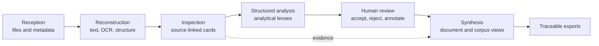

# OuiDire

**Traceable, human-supervised analysis for complex documentary records.**

OuiDire helps reviewers turn long, heterogeneous records into a navigable body of evidence. It combines document extraction, structured cards, multiple analytical lenses, human annotation, and source-linked synthesis.

This repository is a public technical overview. It documents the system's boundaries and design principles without publishing production code, private prompts, client data, or proprietary scoring rules.

[Version française](README.fr.md) · [Architecture](docs/architecture.md) · [Method](docs/method.md) · [Security](SECURITY.md)

## Why OuiDire exists

Reviewing a large record is not just a summarization problem. Reviewers must preserve documentary structure, distinguish sources from interpretations, find recurring patterns across documents, and be able to return from every conclusion to supporting evidence.

OuiDire is designed around that constraint:

> AI may orient and suggest. Humans verify. Sources remain visible.

## System overview

The architecture separates six concerns:

1. **Reception** — accept and identify a documentary corpus.
2. **Reconstruction** — extract text while preserving useful page and paragraph structure.
3. **Inspection** — create atomic, intelligible, source-linked cards.
4. **Analysis** — apply complementary analytical lenses at card, document, and corpus levels.
5. **Human review** — keep machine suggestions distinct from reviewer decisions and notes.
6. **Synthesis** — produce higher-level findings whose supporting evidence can be inspected.

## More than “send a PDF to a model”

OuiDire treats a record as a hierarchy:

| Level | Unit | Purpose |
|---|---|---|
| 1 | Card | Inspect one checkable assertion with its source reference |
| 2 | Document | Identify dominant mechanisms and internal structure |
| 3 | Corpus | Compare documents and detect cross-document patterns |
| 4 | Thesis | Build a reviewable explanatory synthesis |

Different computational passes serve different roles: fast orientation, deeper structured analysis, human evidence work, and focused critical reading. They are not collapsed into a single opaque answer.

## Design principles

- **Traceability over fluency.** A polished conclusion without inspectable evidence is insufficient.
- **Atomicity without mutilation.** Segmentation should clarify a source, not destroy its documentary structure.
- **Human and machine states remain distinct.** Suggestions are not silently converted into findings.
- **Progressive depth.** Expensive or interpretive analysis follows orientation and evidence review.
- **Provider-aware processing.** Digitally generated PDFs, scans, and photographs require different extraction strategies.
- **Synthetic public examples only.** No patient, client, or case material belongs in this repository.

## AI and document-processing stack

The production system can orchestrate multiple model providers and OCR paths. Provider choice depends on the task: extraction, structured classification, overview synthesis, or focused critical review. Public documentation describes roles and interfaces, not private prompts or routing logic.

See [Architecture](docs/architecture.md) for the trust boundaries and [Method](docs/method.md) for the analytical model.

## Demonstration data

The example in [`examples/synthetic-record.json`](examples/synthetic-record.json) is deliberately fictional and contains no personal information. It illustrates the separation between source excerpts, machine suggestions, and human decisions.

## Evaluation

OuiDire is evaluated as a review system, not only as a text generator. Relevant measures include:

- source-reference preservation;
- segmentation quality;
- suggestion precision and reviewer acceptance;
- unsupported-claim rate;
- cross-document retrieval quality;
- end-to-end latency and provider cost;
- export traceability.

No production benchmark is asserted in this public repository until its protocol and reproducible evidence can be published. See [Benchmarks](docs/benchmarks.md).

## What is intentionally not public

- production application source code and infrastructure configuration;
- complete prompts and model-routing policies;
- proprietary analytical taxonomies, weights, and scoring rules;
- authentication, billing, and internal observability code;
- real records, derived case data, or identifying metadata.

Technical diligence access may be arranged privately when appropriate.

## Status

OuiDire is an actively developed product. This repository is documentation, not a deployable copy of the application and not a medical or legal decision system.

## Contact

Project and technical-diligence enquiries: [contact@studiorium.ai](mailto:contact@studiorium.ai).

## Licence

Documentation and examples are currently published as **all rights reserved**. See [LICENSE.md](LICENSE.md). A separate open-source licence may be added later for deliberately released utilities.
