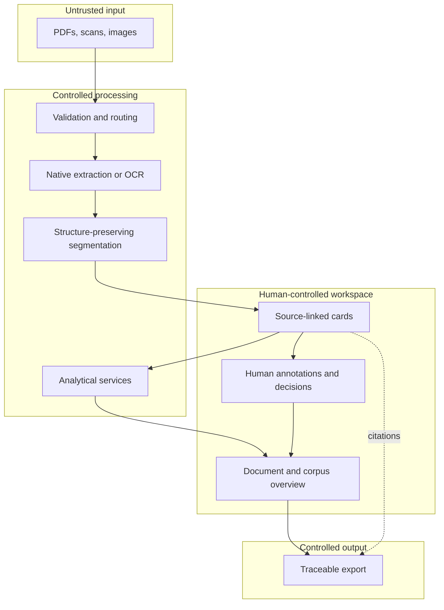

# Architecture

## Public reference model

## Processing stages

### 1. Reception and validation

The system establishes file type, size, provenance metadata, and processing eligibility before invoking extraction services. Uploaded material is treated as untrusted input.

### 2. Extraction and reconstruction

Digitally generated documents may expose usable text directly. Scans and photographs require OCR. The pipeline records the extraction path so later diagnostics can distinguish source quality from model behaviour.

### 3. Structure-preserving segmentation

Where an OCR provider has already identified coherent legal or procedural paragraphs, those paragraphs are preferred. Generic splitting is a fallback for noisy or unstructured sources. The target unit is one intelligible, checkable assertion with an explicit documentary reference.

### 4. Layered analysis

Fast orientation and deeper structured passes are separate operations. Card-level output can be aggregated into document- and corpus-level views, while retaining links to supporting cards.

### 5. Human review

Machine suggestions, human annotations, and final reviewer decisions use separate state. This separation supports correction, disagreement, provenance, and later audit.

### 6. Export

Exports should distinguish quoted source material, machine-generated interpretation, and human-authored conclusions. A reader must be able to locate the evidence behind a finding.

## Provider boundaries

OuiDire can use external OCR and language-model providers. Production credentials remain server-side. Providers receive only the material required for the selected operation, subject to the deployment's privacy configuration and contractual controls.

Exact providers, prompts, fallback thresholds, and routing policies may change and are intentionally not contractualized in this public overview.

## Failure model

The design assumes that extraction and generative models can fail independently. Important failure classes include:

- missing, reordered, or malformed pages;
- poor OCR or broken paragraph boundaries;
- unsupported inferences;
- lost or incorrect citations;
- partial provider responses and timeouts;
- divergence between repeated model runs;
- accidental confusion of machine suggestions with human validation.

The interface and evaluation strategy should make these failures detectable rather than hiding them behind fluent prose.
